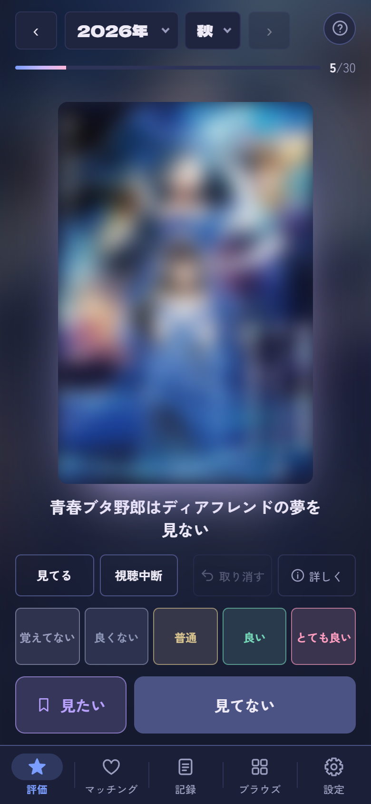
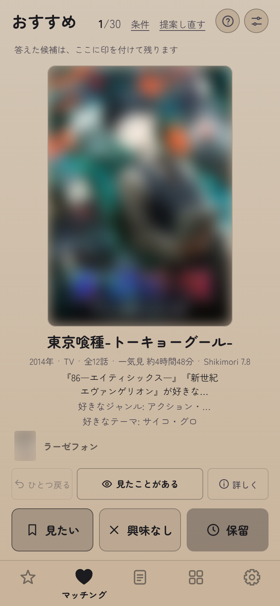
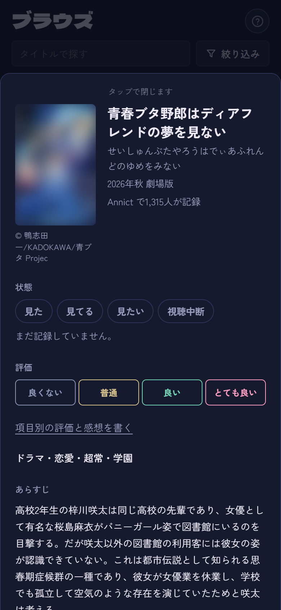
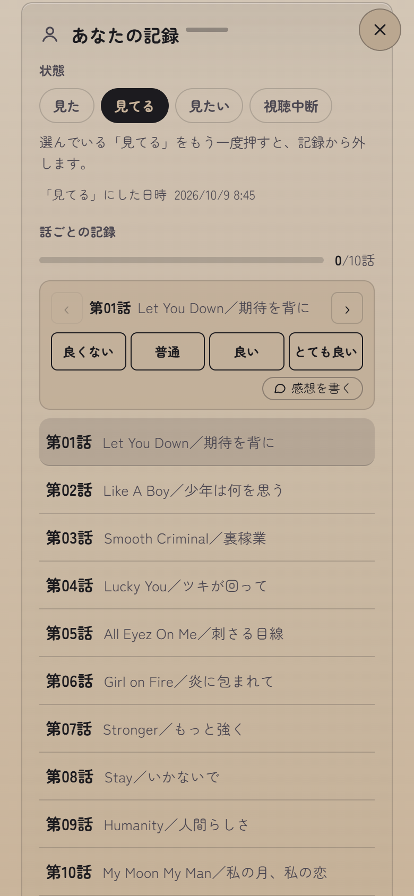
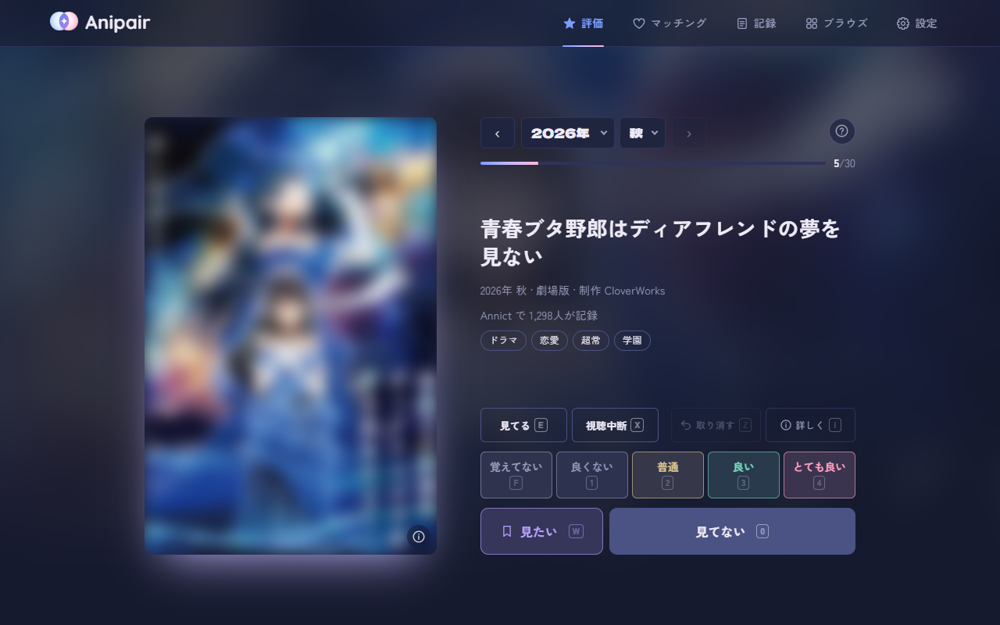

<h1 align="center">
  <br>
  Anipair
</h1>

<p align="center"><strong>あなたの「好き」と、次の「好き」をつなぐ。</strong></p>

[Annict](https://annict.com/) の視聴記録を、タップだけで付けていくためのアプリです。見たアニメを1タップで評価でき、評価から好みを推定して、まだ見ていない作品も提案します。記録はすべて自分の Annict に保存されます。

Annict の非公式の個人開発アプリです（Annict とは関係がありません）。公開版: https://anipair.vercel.app/

| 評価 | マッチング | 作品の詳細 | 話ごとの記録 |
|---|---|---|---|
|  |  |  |  |



## できること

- **評価**: クールごとに過去の作品をさかのぼって、見た・見たい・評価（4段階）を1タップで付ける。クールの人気作のうち答えた数が進み具合として出る。放送の終わった見てる作品には「見終わりましたか」と聞く。「見てない」にした作品は、クールを終えたあとに見直せる
- **マッチング**: 自分の評価から好みを推定して、まだ見ていない作品を1枚ずつ提案する（Shikimori のジャンル・テーマと「似た作品」を使う）
- **記録**: 見てる・見た・見たい・視聴中断の一覧と編集（見てるから開く）。放送クール・評価・放送年・季節・形式・ジャンル・制作会社で絞り込み、好きな順（自分の評価）・人気順・記録順・放送日順で並べ替え（昇順・降順）。見てるの作品は、一覧のカードから次の話を記録できる。見たいには「優先して見る」の印とメモを付けられる
- **話ごとの記録と感想**: 見た・見てるの作品の詳細で、話ごとに4段階で評価して記録する。感想も書ける（書かなければ評価を押すだけ）。作品には総合と4項目の評価と感想の本文を付けられる
- **傾向**: 記録を図にする（評価の分布と甘口・辛口、ジャンルの好みのレーダーチャート、放送年と黄金期、世間との比較、よく見る声優・監督・制作会社など）。世間より高く評価している「声優との相性」も出す
- **実績**: クールの踏破や年・年代の網羅、見た作品の数、Annict での積み重ねで手に入る称号（レア度つき）。手に入れた称号はプロフィールに掲げられる。年間のふり返りもあり、傾向・称号・ふり返りは画像にして共有できる
- **ブラウズ**: クール一覧とタイトル検索、作品の詳細（あらすじ・キャスト・スタッフ・関連作品）。関連作品もアプリの中で開いて、そのまま記録できる。声優・スタッフ・制作会社の名前を押すと、参加作品の一覧が出る。人気順・評価順（評価した人の少ない作品は、点数を平均に寄せて並べる）・おすすめ順で並べ替えられる。放送年（から〜まで）と季節で何年分でもまとめて見られ、自分の記録（「見てない」にした作品も）・形式・ジャンル・制作会社で絞り込める
- **Annict が重い日も**: 前回読み込んだ内容ですぐに表示して、裏で読み直す。送り終える前に閉じた記録は、次に開いたときに送り直せる。設定で Annict の調子を確かめられる
- マスコットの**アニ**（アニメを見る係）と**ペア**（次の好きを見つけてくる係）が、はじめての使い方を案内する。読み込み中や空の一覧にも出てきて、記録やブラウズの画面では、ときどき画面の下からのぞいたり散歩したりする
- 各画面の右上の「?」で、実際の画面の上でボタンを1つずつ指しながら使い方を説明する
- 画面の地は、見ているクールの季節の色になる。明るさ（明るい・暗い・もっと暗い）・片手操作（よく押すボタンを左右どちらに寄せるか）・画面の動きを選べる
- PC ではキーボードだけでも操作できる（← → で画面を切り替え。答えのキーは左手で届く所に並べてあり、割り当ても変えられる）

## 使うために必要なもの

**Annict のアカウント**が必要です。アプリの最初の画面で「Annict でログイン」を押すと使い始められます。

## GitHub 連携（任意）

興味なし・保留・見てない・見たいの優先とメモは Anipair 独自の記録で、Annict には保存できません。Anipair は運営サーバーを持たないため、これらはあなた自身の GitHub リポジトリに保存します。連携しない場合は、使っている端末の中にだけ保存されます。

連携しなくても、すべての機能を使えます。連携すると、次のことができます。

- 興味なし・保留・見てない・見たいの優先とメモを、PC とスマホで共有する
- 作品ごとの記録を、毎日自動でバックアップする（変更履歴つき）

連携しない場合も、設定の「ファイルに書き出す」で、作品ごとの記録を JSON ファイルとして保存できます。含むのは、視聴状況とその日時、評価（5項目と本文）、興味なし・保留・見てない、見たいの優先とメモです。話ごとの記録は含みません（Annict に残ります）。

連携の手順（アプリの設定にも同じ手順があります）:

1. GitHub で private リポジトリを作成します（例: `anipair-data`）
2. [Fine-grained トークン](https://github.com/settings/personal-access-tokens/new)を作成します。Repository access は手順1のリポジトリだけを選び、Permissions の Contents を「Read and write」にします
3. 設定の「GitHub 連携」にリポジトリ名（`ユーザー名/anipair-data`）とトークンを入力し、「連携する」を押します

## データの置き場所

| データ | 置き場所 |
|---|---|
| 見た・見たい・評価などの記録 | あなたの Annict |
| 興味なし・保留・見てない・見たいの優先とメモ | この端末のブラウザ（GitHub と連携した場合は、あなたの private リポジトリにも） |
| トークン・設定・キーバインド | この端末のブラウザの中だけ |
| 前回読み込んだ記録の写し・まだ送り終えていない記録の控え・書きかけの感想 | この端末のブラウザの中だけ（すぐ表示するためと、送り直すため） |

ログアウトすると、Annict と GitHub のトークンと、Annict の記録の写しを端末から消します。この端末にしかない記録（興味なし・見てない・称号など）は、同じアカウントでログインし直したときのために端末に残し、ほかのアカウントでログインしても表示しません。これらも消すには、設定の「ログアウトして、この端末の記録も消す」を使います。

運営サーバーはなく、利用者の情報は保存しません。サーバーで動くのは、ログインの受け渡しと Shikimori への中継の2つの処理だけです。通信先は Annict と Shikimori（このサイトの中継を経由）と Wikipedia で、GitHub と連携した場合は GitHub にも送信します。

## 注意

- 非公式の個人開発アプリです。Annict の API はベータ版で、予告なく変わることがあります。変わると、動かなくなる機能が出るかもしれません
- 表紙は Shikimori のポスターを優先し、無ければ Annict の API の画像（作品の公式サイトのもの）を表示しています。画像の権利は各権利者にあります
- Annict から読む情報は、Annict が公開している API で取れるものだけです（Annict のページは読みません）
- 作品の詳細に出すあらすじは、日本語版 Wikipedia の記事の冒頭を、出典とライセンス（CC BY-SA 4.0）を添えて表示しています

## 開発

Vite + React + TypeScript の静的サイトです（ログインの受け渡しだけ、Vercel の関数 `api/annict-token.ts`）。

```
npm install
npm run dev
```

`http://localhost:5173` が開きます（Shikimori への中継は、開発サーバーの中で同じ処理が動きます）。

- **個人用アクセストークンで使う**: ローカルでは「Annict でログイン」のボタンが出ません（ログインの関数が動かないため）。最初の画面の「開発者向け: 個人用アクセストークンで使う」を開き、Annict の[アプリケーションの設定](https://annict.com/settings/apps)で作った個人用アクセストークン（権限は「読み込み + 書き込み」）を貼ってください
- **「Annict でログイン」をローカルで試す**: Annict に[アプリケーションを登録](https://annict.com/oauth/applications)し（スコープは「読み込み + 書き込み」、リダイレクト URI は `http://localhost:3000/`）、`.env.example` を見て `.env.local` に値を入れてから、`vercel dev` で起動します
- **自分で公開する**（公開版を使うだけなら不要です）: このリポジトリをフォークして Vercel につなぎ、`.env.example` にある4つの環境変数を設定します（`ANNICT_CLIENT_SECRET` などに `VITE_` を付けないでください。付けると公開の JS に入ります）。Annict のアプリケーションのリダイレクト URI には、公開するアドレス（末尾のスラッシュまで）を登録します

```
npm run lint
npm run typecheck
npm test
npm run build
```

## 謝辞

- [Annict](https://annict.com/) — 記録の保存先とデータ。ありがとうございます
- [Shikimori](https://shikimori.io/) — 作品データの一部（ジャンル・テーマ・似た作品・一部の表紙・声優やスタッフ・制作会社の参加作品）
- [Wikipedia](https://ja.wikipedia.org/) — 作品のあらすじ（CC BY-SA 4.0）

## ライセンス・規約

ソースコードは [MIT](LICENSE) です。ただし **Anipair の名前とロゴ、キャラクターのアニとペア（絵・名前・設定）は著作権を保持しており、MIT ライセンスの対象外です**（無断の使用・改変・再配布はできません。詳しくは [LICENSE](LICENSE) の「例外」）。フォークして公開するときは、名前・ロゴ・キャラクターを差し替えてください。

- [利用規約](https://anipair.vercel.app/terms.html)
- [プライバシーポリシー](https://anipair.vercel.app/privacy.html)
